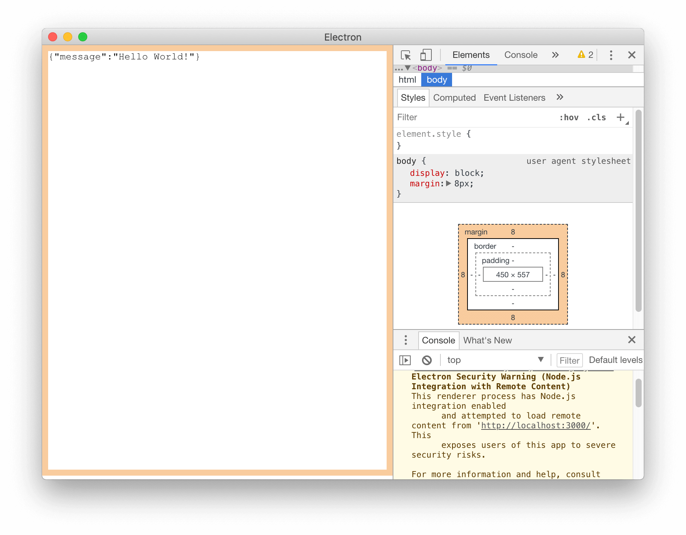

# electron-typescript-express.js-webapi-start
Web API with Electron+TypeScript+Express.js



```shell
$ gulp scripts
$ yarn run
```

### Links
https://electronjs.org/docs/tutorial/quick-start

https://mherman.org/blog/developing-a-restful-api-with-node-and-typescript/